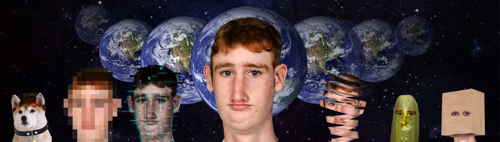
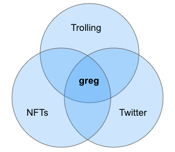

# Multiverse of gregs - the Missing Whitepaper

Author: __Army greg__ [@armygreg9](https://twitter.com/armygreg9)
Status: *Unofficial, not reviewed by greg yet*

## Introduction
[@greg16676935420](https://twitter.com/greg16676935420) is a popular parody/trolling/shitposting online persona, followed by hundreds of thousands of users. greg regularly posts on Twitter and engages with well-known accounts in a way that his many followers find uniquely entertaining.

Together with [Matt Esparza](https://twitter.com/matthewesp), greg created the Multiverse of greg (Twitter: [@gregmultiverse](https://twitter.com/gregmultiverse), OpenSea: [MultiverseOfGreg](https://opensea.io/collection/multiverse-of-gregs)) consisting of greg himself and 153 different greg-derived characters.

The greg phenomenon is at the intersection of Twitter, NFTs, and Trolling:

## The Multiverse of greg
greg and many of his derived characters span across the NFT multiverse and Twitter. The various characters are operated by anonymous users, who may or may not own matching Multiverse Tokens. Twitter's hexagonal NFT profile picture can make it easy for new and existing greg characters to assimilate in the multiverse. The greg account is more likely to interact with "official" greg characters.

greg-derived characters often interact with the greg account, with each other, and with some of the Twitter accounts greg is known to engage with. The more characters are actively involved, the easier it will be for the multiverse to expand.

### How to become a greg-derived character
Anyone is free to form an identity of a greg-derived character as long as it's not taken or clearly inactive. You can also invent a new greg character.
- Before you start, learn about greg, become familiar with his vibe, and absorb the spirit of the greg multiverse.
- Optionally, buy a greg multiverse NFT. Owning an NFT will make it easier for you to gain followers and increase engagement. greg and the multiverse account are more likely to support your account. Unlike other NFT projects, the Multiverse of greg only has 153 tokens, this is extremely unique!
- Set up a twitter account for your character: upload a photo and fill out the bio.
- Follow greg, turn on notifications on his tweets.
- It is recommended that you follow most other greg characters so you can contribute to the network effect of the multiverse.
- Follow accounts that greg regularly interacts with.
- Join the [Unofficial Discord server](https://discord.gg/UA6RarT8) and introduce yourself.

### Recommended behavior as a greg-derived character

greg-derived characters have their own personalities, interests, and opinions. It's very cool when they adopt greg's communication style when possible, and when they interact with greg and with each other based on their themes.

- Don't be shy to Like many of greg's posts, as well as other greg-derived characters'.
- greg's unique good morning and good night posts always deserve the multiverse's love.
- Support other greg-derived characters, help them bootstrap their characters to keep them motivated.
- Pile on threads when appropriate.
- Comment on any twitter threads you like in greg's style, when you feel the vibe.
- Don't at-mention greg too often, don't try to aggressively get his attention.
- Use clean language.
- Mention the multiverse NFTs only when appropriate, and not too often.
- Be patient, this is a long-term project.

## Project Goals

- Get greg to 1 million Twitter followers
- Get Elon Musk to follow greg and retweet him at least once
- Get greg Twitter Verified (blue check)
- Entertain ourselves while entertaining others
- Grow the multiverse of greg with many active greg-derived characters
- Make the Multiverse of greg tokens blue chip NFTs

## Roadmap

- Generation 1 mint (153 tokens)
- 1M followers milestone
- IRL greg conference?
- Generation 2 mint?

---

Send feedback to: armygreg9@gmail.com or DM [@armygreg9](https://twitter.com/armygreg9)

